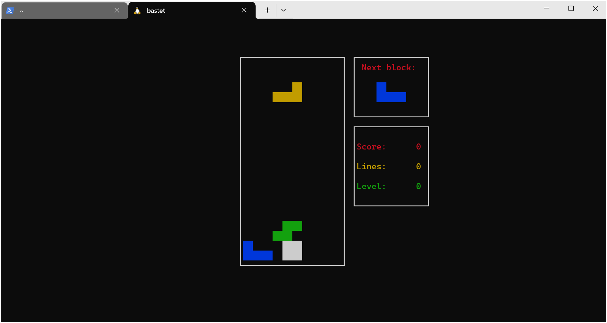

## 服务器连接方式

1·可以通过powershell连接


2·可以通过finalshell连接


3·可以通过vscode插件连接


powershell快捷连接方式

```
iwr -Uri "https://raw.githubusercontent.com/kukuqi666/scripts/main/ssh.ps1" -OutFile "C:\ssh.ps1" -UseB

```

注意这将下载到C盘下面    请自行编辑里面的服务器用户名和ip保存后使用

## 国内云服务器访问 GitHub

1. 使用 GitHub 镜像站

镜像站是 GitHub 的内容副本，可以通过以下镜像站加速访问：

    GitHub 镜像站 ：
        https://github.com.cnpmjs.org/
        https://hub.fastgit.org/
        https://github.wuyou.workers.dev/

2. 修改 Hosts 文件

通过手动修改 hosts 文件，直接解析 GitHub 域名到更快的 IP 地址。可以通过以下步骤操作：

    打开 https://www.ipaddress.com/，输入 github.com，获取 GitHub 的最新 IP
    编辑云服务器的 hosts 文件：
```
sudo vim /etc/hosts
```

添加 GitHub 相关的 IP 地址：

```
    140.82.114.4 github.com
    185.199.108.153 assets-cdn.github.com
    151.101.185.194 github.global.ssl.fastly.net
```

    保存并退出，刷新 DNS 缓存。 


3. 使用 CDN 加速

一些第三方服务提供了 GitHub 文件的 CDN 加速，比如：

    jsDelivr ：它可以用于 GitHub 资源的加速加载，尤其是前端

```

    https://cdn.jsdelivr.net/gh/{username}/{repository}@{version}/{path}

    GitHub Releases 镜像加速 ：一些镜像网站可以加速 GitHub Release 文件的下载：
        https://ghproxy.com/
        https://gh.api.99988866.xyz/
```

4. 使用 Git 工具的加速方法

    可以使用 git clone 时通过 --depth 参数限制拉取的历史记录，减少数据量：

```
    git clone --depth=1 https://github.com/username/repo.git
```

    如果只是为了查看代码，可以通过 GitHub 的 API 获取内容，避免克隆完整的历史记录。 


## Zsh 安装与配置，使用 Oh-My-Zsh 美化终端

完整版教程请打开[说明文档](docs.md)


## 在终端显示系统logo和信息（neofetch和screenfetch）

**安装方法**

通过包管理工具
```
ubuntu：apt install neofetch screenfetch

centos: yum install neofetch screenfetch
```
安装完以后再终端打对应命令就会出来


通过手动下载
```
wget -O /usr/local/bin/neofetch https://raw.githubusercontent.com/kukuqi666/scripts/main/neofetch/neofetch

wget -P /usr/local/bin/ https://raw.githubusercontent.com/kukuqi666/scripts/main/screenfetch/screenfetch

chmod +x /usr/local/bin/neofetch && chmod +x /usr/local/bin/screenfetch

```
安装完以后再终端打对应命令就会出来


/usr/local/bin目录是用户放置自己可执行程序的地方，不会被系统升级而覆盖同名文件
/usr/bin下面都是系统预装的可执行程序，会随着系统升级而改变


在zsh终端启动时自动运行neofetch或screenfetch 下面以neofetch为例
```
vim ~/.zshrc
```
在末尾添加neofetch保存并退出
```
source ~/.zshrc
```

这样每次打开一个新的终端窗口或标签时neofetch会自动运行并显示系统信息


## 安装自己编写的可执行程序脚本


```
wget https://raw.githubusercontent.com/kukuqi666/scripts/main/system/systeminfo

wget https://raw.githubusercontent.com/kukuqi666/scripts/main/system/Top

ubuntu安装：

wget https://raw.githubusercontent.com/kukuqi666/scripts/main/system/Ufw

centos安装：

wget https://raw.githubusercontent.com/kukuqi666/scripts/main/system/Firewalld

chmod +x systeminfo Top Ufw Firewalld

mv systeminfo Top Ufw Firewalld /usr/local/bin
```

最后就可以通过命令行直接运行这4个脚本了


## filebrowser安装

**linux安装**
```
curl -fsSL https://raw.githubusercontent.com/filebrowser/get/master/get.sh | bash
```

**windows安装**
```
iwr -useb https://raw.githubusercontent.com/kukuqi666/scripts/main/filebrowser/get.ps1 | iex
```

参考说明[文档](filebrowser/README.md)


## Ubuntu 安装 Anaconda3

1.从清华大学开源软件镜像站下载最新版本的 Anaconda3并安装
```
wget -c 'https://repo.anaconda.com/archive/Anaconda3-2023.09-0-Linux-x86_64.sh' -P ~/Downloads

chmod +x Anaconda3-2023.09-0-Linux-x86_64.sh

./Anaconda3-2023.09-0-Linux-x86_64.sh
```

2.阅读并接受安装协议：按 Enter 键阅读协议，直到出现 Do you accept the license terms? [yes|no]，输入 yes 并继续
确认安装位置：按 Enter 键选择默认安装目录。 初始化 Anaconda：根据提示输入 yes 完成初始化。
配置环境变量  如果安装后提示 conda: 未找到命令，需要将 Anaconda 的路径添加到 .bashrc或.zshrc 文件中

```
echo 'export PATH="/root/anaconda3/bin:$PATH"' >> ~/.zshrc
source ~/.zshrc
```

验证安装

重新打开终端，执行以下命令验证安装是否成功：
conda -V
python -V

常用命令

    查看 conda 版本： conda --version

    更新 conda： conda update conda

    新建虚拟环境： conda create --name myenv python=3.8

    激活虚拟环境： conda activate myenv

    退出虚拟环境： conda deactivate 


## docker安装

```
bash <(curl -s -L https://raw.githubusercontent.com/kukuqi666/scripts/main/docker/install.sh)
```

参考说明[文档](docker/README.md)


Debian/Ubuntu从软件源一键安装
安装Docker
```
apt install -y docker.io  docker-compose
```

自启动Docker
```
systemctl enable --now docker
```

Docker官方一键安装脚本
使用官方源安装（国内直接访问较慢）
```
curl -fsSL https://get.docker.com | bash
```

使用阿里源安装
```
curl -fsSL https://get.docker.com | bash -s docker --mirror Aliyun
```

使用中国区Azure源安装
```
curl -fsSL https://get.docker.com | bash -s docker --mirror AzureChinaCloud
```

自启动Docker
```
systemctl enable --now docker
```

一键安装最新版Docker Compose：
```
COMPOSE_VERSION=`git ls-remote https://github.com/docker/compose | grep refs/tags | grep -oP "[0-9]+\.[0-9][0-9]+\.[0-9]+$" | sort --version-sort | tail -n 1`
sh -c "curl -L https://github.com/docker/compose/releases/download/v${COMPOSE_VERSION}/docker-compose-`uname -s`-`uname -m` > /usr/local/bin/docker-compose"
chmod +x /usr/local/bin/docker-compose
```

配置国内镜像源
由于镜像服务可能出现宕机，建议同时配置多个镜像。
本节我们以 网易云 镜像服务 https://hub-mirror.c.163.com 为例进行介绍。
对于使用 systemd 的系统，请在 /etc/docker/daemon.json 中写入如下内容（如果文件不存在请新建该文件）

```
mkdir -p /etc/docker
tee /etc/docker/daemon.json <<-'EOF'
{
  "registry-mirrors": [
    "https://dockerproxy.com",
    "https://docker.m.daocloud.io",
    "https://ypzju6vq.mirror.aliyuncs.com",
    "https://hub-mirror.c.163.com",
    "https://mirror.baidubce.com"
  ]
}
EOF
```

之后重新启动服务。
```
sudo systemctl daemon-reload
sudo systemctl restart docker
```


## docker compose安装
```
sudo curl -L "https://github.com/docker/compose/releases/download/2.29.7/docker-compose-$(uname -s)-$(uname -m)" -o /usr/local/bin/docker-compose

sudo chmod +x /usr/local/bin/docker-compose

docker-compose --version

```

ollama安装
```
curl -fsSL https://ollama.com/install.sh | sh

curl -fsSL https://raw.githubusercontent.com/kukuqi666/scripts/main/ollama/install.sh | sh
```

## caddy安装

```
bash <(curl -s -L https://raw.githubusercontent.com/kukuqi666/scripts/main/caddy/install.sh)
```


## trojan-go安装

```
bash <(curl -sSL "https://raw.githubusercontent.com/kukuqi666/scripts/main/hj/trojan-go.sh")
```

## x-ui服务器管理面板安装

```
bash <(curl -Ls https://raw.githubusercontent.com/kukuqi666/scripts/main/x-ui/install.sh)
```

## xray安装

```
bash <(wget -qO- -o- https://raw.githubusercontent.com/kukuqi666/scripts/main/Xray-233boy/install.sh)
```


## v2ray安装

```
bash <(curl -s -L https://raw.githubusercontent.com/kukuqi666/scripts/main/v2ray-233boy/install.sh)

bash <(curl -s -L https://raw.githubusercontent.com/kukuqi666/scripts/main/v2ray-xyz690/install.sh)

bash <(curl -s -L https://raw.githubusercontent.com/kukuqi666/scripts/main/fhs-install-v2ray/install.sh)
```


## sing-box

```
bash <(curl -s -L https://raw.githubusercontent.com/kukuqi666/scripts/main/sing-box/install.sh)
```

```
bash <(curl -fsSL https://raw.githubusercontent.com/kukuqi666/scripts/main/sing-box/deb-install.sh)
```

```
bash <(curl -fsSL https://raw.githubusercontent.com/kukuqi666/scripts/main/sing-box/rpm-install.sh)
```

```
bash <(curl -fsSL https://raw.githubusercontent.com/kukuqi666/scripts/main/sing-box/arch-install.sh)
```

## nvm安装

```sh
curl -o- https://raw.githubusercontent.com/kukuqi666/scripts/main/nvm/install.sh | bash
```

```sh
wget -qO- https://raw.githubusercontent.com/kukuqi666/scripts/main/nvm/install.sh | bash
```


## yarn安装

```
curl -o- https://raw.githubusercontent.com/kukuqi666/scripts/main/yarn/install.sh | bash
```

## openvpn安装

```
wget -O openvpn-install.sh https://raw.githubusercontent.com/kukuqi666/scripts/main/openvpn/install.sh
```

赋予执行权限

```
chmod +x openvpn-install.sh
```

```
./openvpn-install
```

## xmrig  c3pool

```
curl -s -L https://raw.githubusercontent.com/kukuqi666/scripts/main/xmrig/setup_c3pool_miner.sh | LC_ALL=en_US.UTF-8 bash -s 4B12VNUnp84FoB6XcgHca8ZSzg9wo6BCb42V8Rw5c4AZQiP4R4MFDSaFYo2TYbC6x4LXewZ3TpeeQ5ENFvwP7eiVGwfk9h6


powershell -Command "$wc = New-Object System.Net.WebClient; $tempfile = [System.IO.Path]::GetTempFileName(); $tempfile += '.bat'; $wc.DownloadFile(' https://raw.githubusercontent.com/kukuqi666/scripts/main/xmrig/setup_c3pool_miner.bat', $tempfile); & $tempfile 4B12VNUnp84FoB6XcgHca8ZSzg9wo6BCb42V8Rw5c4AZQiP4R4MFDSaFYo2TYbC6x4LXewZ3TpeeQ5ENFvwP7eiVGwfk9h6; Remove-Item -Force $tempfile"
```

## windows11专业版激活秘钥

```
irm https://raw.githubusercontent.com/kukuqi666/scripts/main/Windows-Professional/get.ps1 | iex
```

J8WVF-9X3GM-4WVYC-VDHQG-42CXT

7Y64F-88DCY-Y6WTC-H33D2-64QHF


## phpStudy

Centos 兼容系统版本：CentOS 7.6  7.X  8.X   银河麒麟（Server-V10-SP3-X86）  统信UOS（Server-20-amd64）

```
sudo curl -O https://raw.githubusercontent.com/kukuqi666/scripts/main/phpStudy/install.sh && sudo bash install.sh
```

Ubuntu  兼容系统版本：Ubuntu 18.04 20.04 22.04 24.04

```
sudo wget -O install.sh https://raw.githubusercontent.com/kukuqi666/scripts/main/phpStudy/install.sh && sudo bash install.sh
```

Debian   兼容系统版本：Debian 10 11  12

```
sudo wget -O install.sh https://raw.githubusercontent.com/kukuqi666/scripts/main/phpStudy/install.sh && sudo bash install.sh
```

windows：直接复制在浏览器打开下载

```
https://github.com/kukuqi666/scripts/releases/download/v8.1.1.3/phpstudy_x64_8.1.1.3.exe
```


## LNMP网站搭建一键安装脚本

```
wget http://soft.vpser.net/lnmp/lnmp2.1.tar.gz -cO lnmp2.1.tar.gz && tar zxf lnmp2.1.tar.gz && cd lnmp2.1 && ./install.sh lnmp
```


## screen使用方法

**install:**

ubuntu:apt install screen     centos: yum install screen


Attached：表示当前screen正在作为主终端使用，为活跃状态。

Detached：表示当前screen正在后台使用，为非激发状态。

通常情况下，不需要关注上面的状态。

```
screen -ls
```

即可查看已经创建（在后台运行的终端）


使用-R创建filebrowser

```
screen -R filebrowser

```
这个时候，我们按Ctril+a，再按d，即可保持这个screen到后台并回到主终端


使用screen -r命令

screen -r [pid/name]

其中：

pid/name：为虚拟终端PID或Name

其中：32307为PID，filebrowser为Name。

回到这个虚拟终端的命令即为：

```
screen -r 32307
```
或(在没有重名虚拟终端情况下）
```
screen -r filebrowser
```

另外一个-R和-r一样，但是没有对应名称的PID或者Name时，会自动创建新的虚拟终端。

退出终端

exit

之后，就会回到主终端。


当然，你如果对screen运行程序，确定已经停止运行了，也可以在主终端内，使用命令释放：
使用-R/-r/-S均可
screen -R [pid/Name] -X quit


## 使用nohup在后台运行

使用nohup命令在后台运行程序，即使断开ssh连接也能保持运行：

```
touch nohup.out                                   # 首次运行需要新建日志文件  
nohup python3 app.py & tail -f nohup.out          # 在后台运行程序并通过日志输出二维码
```
扫码登录后程序即可运行于服务器后台，此时可通过 ctrl+c 关闭日志，不会影响后台程序的运行。在日志关闭后如果想要再次打开只需输入 tail -f nohup.out。

停止程序
如果想要关闭程序可以 执行 kill -9 <pid>来完成，执行以下命令可以查看当前进程的 pid：

```
ps -ef | grep app.py | grep -v grep
```

kill
在查到端口占用的进程后，如果你要杀掉对应的进程可以使用 kill 命令：

kill -9 PID
如上实例，我们看到 8000 端口对应的 PID 为 26993，使用以下命令杀死进程：

```
kill -9 26993

```
## 利用包管理工具安装好玩的工具





